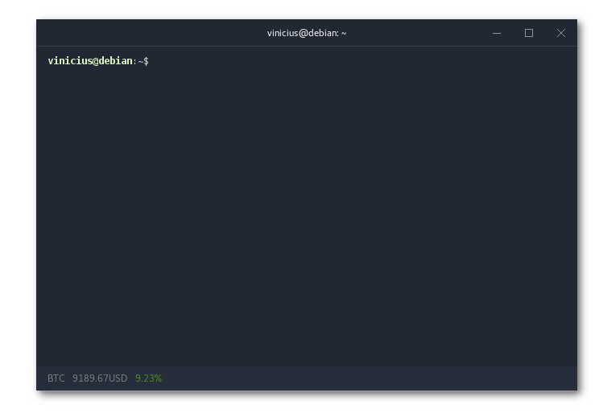

# hypercrypto [](https://www.npmjs.com/package/hypercrypto)


**A cryptocurrency status line plugin for [Hyper](https://hyper.is/).** It displays a chosen cryptocurrency's price and 24h percentage changes.




All the data comes from [coinmarketcap](https://coinmarketcap.com/) API. 

## Installation


Edit `~.hyper.js` adding `'hypercrypto'` to `plugins`:

```js
module.exports = {
  ...
  plugins: ['hypercrypto']
  ...
}
```

or, if you are using the plugin manager [`hpm-cli`](https://github.com/zeit/hpm):

    hpm i hypercrypto
    
## Configuration


Bitcoin is the default hypercrypto's currency, to change it you can edit the configuration json file at `.hyper_plugins/node_modules/hypercrypto/coin.json`. For example, changing it to Monero would mean editing the json to:

```json
{
  "coin": "monero"
}
```
